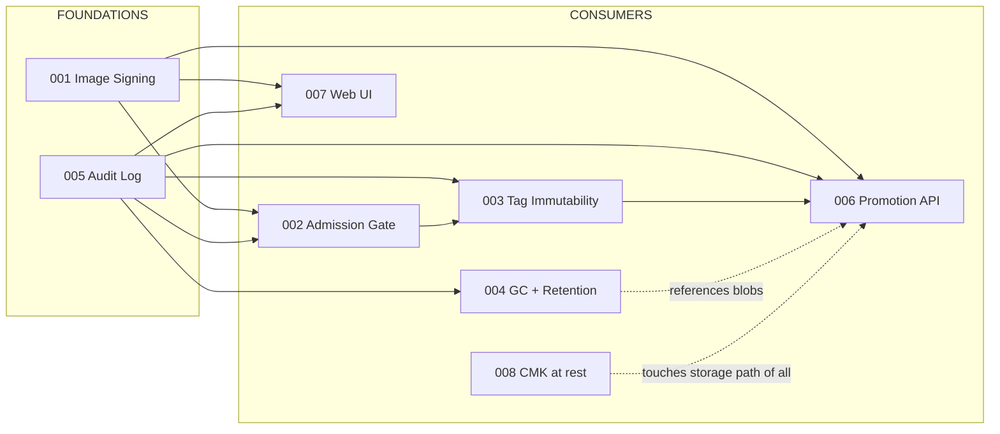

# NebulaCR Next-Major-Release Design Index

Eight feature designs targeting parity with Azure Container Registry and
Sonatype Nexus. Each per-feature doc follows the nine-section template
(problem / approach / CRD / routes / schema / failure / migration / test /
slice count) defined in [PROMPT.md](./PROMPT.md).

All designs honour the project memory rulings: VulnDB and Queue stay behind
traits; new persistent state goes in Postgres; Redis stays ephemeral; every
feature has a `nebulacr.toml` kill-switch defaulting to OFF.

## Status

| #   | Feature                          | Doc                                            | Status   | Effort   |
| --- | -------------------------------- | ---------------------------------------------- | -------- | -------- |
| 001 | Cosign/Notation image signing    | [001-image-signing.md](./001-image-signing.md) | proposed | 4 slices |
| 002 | Pull-time admission gate         | [002-admission-gate.md](./002-admission-gate.md) | proposed | 3 slices |
| 003 | Tag immutability + quarantine    | [003-tag-immutability-quarantine.md](./003-tag-immutability-quarantine.md) | proposed | 3 slices |
| 004 | Garbage collection + retention   | [004-gc-retention.md](./004-gc-retention.md)   | proposed | 4 slices |
| 005 | Append-only signed audit log     | [005-audit-log.md](./005-audit-log.md)         | proposed | 3 slices |
| 006 | Atomic promotion API             | [006-promotion-api.md](./006-promotion-api.md) | proposed | 3 slices |
| 007 | Web UI parity                    | [007-web-ui-parity.md](./007-web-ui-parity.md) | proposed | 4 slices |
| 008 | CMK / envelope encryption at rest | [008-cmk-encryption-at-rest.md](./008-cmk-encryption-at-rest.md) | proposed | 4 slices |

A "slice" is calibrated against the scanner work — each is roughly one week
of engineer time including tests and docs.

## Dependency graph

Solid arrows = hard dependency. Dashed = same code path; sequencing matters.

## Critical path

**Ship 005 (Audit Log) and 001 (Image Signing) first.** Together they unblock
six of the remaining eight features.

- **005 unblocks 002, 003, 004, 006, 007.** Every state-changing feature
  needs a durable, queryable audit record. The current in-memory ring buffer
  (`crates/nebula-registry/src/audit.rs:43`) cannot survive a restart and
  cannot be shown in a UI timeline. A real append-only Postgres log with a
  hash chain is the substrate every other feature writes to.
- **001 unblocks 002 (signature-required policy), 006 (signatures must be
  copied during promotion), and 007 (signature viewer page).** The cosign
  artifact convention also informs how 003's quarantine state is exposed
  (referrers API).

If only one slot is available, do 005 first — it is genuinely a substrate;
001 is a feature that consumes its substrate.

## Cross-cutting decisions (locked)

- **Pure Rust.** Signing uses `sigstore-rs`; no shelling out to `cosign`.
  Notation support is behind a `Verifier` trait; first impl is sigstore-only.
- **Postgres for new persistent state.** New tables: `signatures`,
  `verification_policies`, `audit_log`, `tag_state`, `gc_runs`, `promotions`,
  `wrapped_deks`. Redis only caches ephemeral admission decisions
  (sub-minute TTL).
- **2-segment and 3-segment paths** are first-class for every new route,
  matching the existing pattern at `crates/nebula-registry/src/main.rs:2924-2980`.
- **Kill-switch in `nebulacr.toml`** under each feature's section, default
  `enabled = false`. Existing deployments are no-op upgrades.
- **CRD additions are additive only.** `Project.spec.immutable_tags` and
  `Project.spec.retention_policy` already exist
  (`crates/nebula-controller/src/main.rs:88-112`); 003 and 004 extend them.
- **CLI surface (`nebulacr`) and MCP tool surface (`nebula-mcp`) are
  designed alongside the HTTP routes**, not bolted on.
